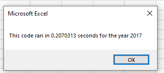
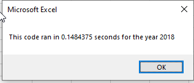

# Stock-analysis

# Overview of the project
The purpose of this was to review the stock data for 2017 and provide an automated script that will run the data upon command by the user. This challenge utilized the VBA funciton in excel to run the data for the year 2017 and 2018. the purpose of the assignment was to refractor a code that was already provided and apply this to the new dataset.

## Results

Running a refractured code utilizing the VBA yealed faster results thn running this initially on its own. as a result of refracturing the code, it decreased the run time and optimized functionality. The stock performance did very similar between the two years. Only two tickers in both years were successful and positive.
The year for 2017 took longer to run then the one for 2018. below are the rates at which the analysis ran

## Summary
### Advantages or disadvantages
 
* Advantages to refactoring code are that some pieces of code that minimally change, do not need to be edited. it allwos for patterns to be recoognized between codes, making the run time faster with use. Having loops to run the data make it beneficial to quickly run the same script numerous times.
* Disadvantages include being able to follow along with the code and understand what is requested. In some places, the code is not clear, thus requiring further analysis. Another disadvantage to refractoring code is making it too specific to the code being run. For example, if the code is being used for 2017 and this is specifically listed, the user would need to make sure that when runnign 2018 data, it got changed in the code. if column names are changed, these would also need to be updated.
* Using original verses refracturing code also has benefits. It allows a user to be able to run code on a specific data set. Writing original code may be easier, allowing for details to be put in, but when passed along to someone else, may be complex to read. Using refracturing is more of a clean up process. It does not allow for the same code to be writtin multiple times in different ways, but allows core code to be copied over from one to another.
