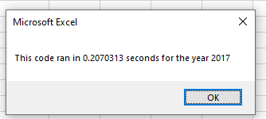
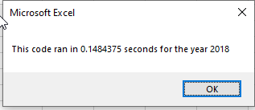

# Stock-analysis

# Overview of the project
The purpose of this was to review the stock data for 2017 and provide an automated script that will run the data upon command by the user

## Results
The stock performance did very similar between the two years. Only two tickers in both years were successful and positive.
The year for 2017 took longer to run then the one for 2018. below are the rates at which the analysis ran

## Summary
### Advantages or disadvantages
* Advantages to refactoring code are that some pieces of code that minimally change, do not need to be edited. 
* Disadvantages include being able to follow along with the code and understand what is requested. In some places, the code is not clear, thus requiring further analysis
* Dhe original script was utilized to review why pieces of code were not working.
